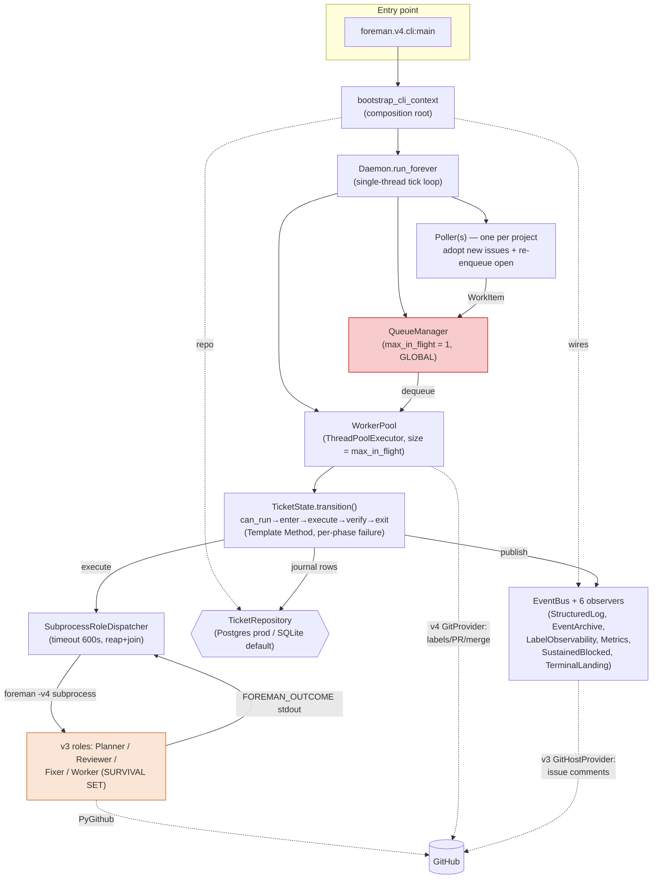

# Architecture Review: foreman v4 (orchestration core + autonomous loop)

**Reviewer:** architecture-review skill (driven by Wren) · **Date:** 2026-06-25
**Scope:** `packages/foreman/src/foreman/v4/` — the v4 state machine, daemon
tick-loop, queue/worker pool, repository layer, event bus, and the
subprocess role dispatcher. The residual v3 surface is examined only where v4
depends on it. Role *prompt* quality and role-internal logic are out of scope.
**System profile:** Long-running **daemon** · multi-project GitHub-issue→PR
orchestrator · single process, low ticket-volume, internally operated ·
Python 3.12 · PyGithub / psycopg / claude-agent-sdk · **Postgres in production**
(SQLite available).

## Executive summary

foreman v4 is a **well-built orchestration core** wrapped around a **still-live
v3 role layer** — and that second clause is the dominant architectural fact.
The v4 substrate (state machine, daemon, queue, worker pool, repository, event
bus) is genuinely strong: a clean Template-Method state lifecycle with rigorous
per-phase failure handling, a hardened subprocess dispatcher, real
anti-corruption layers around the vendor libraries, and a **mechanically
enforced** v3/v4 import boundary. But the roles themselves (Planner/Reviewer/
Fixer/Worker) still run as v3 code invoked via subprocess, and v4 depends on a
documented "survival set" of v3 modules (`git_host`, `roles`, `auth`,
`worktree`). The migration is **paused, not finished** — and the longer the
"temporary" coexistence runs, the more it hardens into permanence.

The single most important *risk* is **C1: there is no crash-recovery
reconciliation** — if the daemon dies mid-transition, the in-flight journal row
leaks and the ticket is re-enqueued into a *second* row on restart, with only
role idempotency standing between that and duplicated GitHub side-effects. The
single most important *tradeoff* is **`max_in_flight = 1`**: the system runs
fully serial today, which buys correctness and simplicity but means the
concurrency machinery is built-but-unexercised, and one slow ticket blocks
*every* project. Both are fine for the current dogfood scale; both must be
resolved before the throughput knob is ever turned up.

## Quality-attribute scorecard

Scale: 1 = structural rework needed · 3 = sound with notable gaps · 5 = exemplary.
Attributes weighted for a low-volume, internally-operated daemon mid-migration.
Deliberately **de-weighted**: request latency / p99 / load-scaling (not a
request-serving system; serial by design), and deep adversarial security (internal
tool, sound App-token model) — these are noted, not scored as load-bearing.

| Attribute | Score | One-line justification |
|---|---|---|
| Reliability | 3/5 | Excellent per-transition failure handling + runaway caps, but **no crash-recovery reconciliation** (C1). |
| Availability | 3/5 | Subprocess lifecycle hardened (timeout/reap), but deploy-restart kills in-flight work and `max_in_flight=1` couples all projects (I1, T1). |
| Observability | 4/5 | Event bus + 6 observers + structured JSONL + per-role streamed logs + a full state journal. A real strength. |
| Operability | 3/5 | Single config resolver is clean, but SQLite-default-vs-Postgres-prod foot-gun (I3) and an inert backup subsystem (I4) muddy "what's actually running." |
| Modifiability | 3/5 | The v4 core is highly modifiable (Protocols, registry, Template Method); the v3/v4 split + dual GitHub adapters mean GitHub-touching changes span two layers (I2, I5). |
| Testability | 4/5 | Protocols + fakes + a contract suite run against *both* repository impls + composition-root DI. The "defaults to keep tests green" pattern is the one wrinkle (M1). |
| Security | 4/5 | Per-role short-lived GitHub App installation tokens (no PAT fallback), pydantic-validated config boundary. Solid. |

## Tradeoff points (the headline)

> The decisions where two qualities genuinely conflict and someone chose.

1. **`max_in_flight = 1` — serial global execution.** Trades **throughput**
   against **correctness + simplicity**. Leans all the way to simplicity: one
   ticket at a time across *all* projects means no concurrent-ticket races, no
   per-ticket lock contention to get right — but the `WorkerPool` /
   `QueueManager` concurrency machinery is built and **only ever exercised at
   1**. Raising the knob is exactly where C1 (no reconciliation) and the
   double-row hazard would bite. Right call *for now*; it is also a latent
   sensitivity point — the day someone sets `max_in_flight = 4` is the day
   untested concurrency paths go live. Evidence: `config.py:317`,
   `worker_pool.py:75-77`, `daemon.py:96`.

2. **Idempotency-as-recovery instead of reconciliation.** Trades
   **implementation simplicity** against **crash-safety**. The poller
   re-enqueues every open ticket each tick and *relies on the role being
   idempotent* to avoid duplicate GitHub effects (`poller.py:8-15` comment,
   "deferred per spec C3"), rather than reconciling orphaned in-flight work on
   startup. Simpler to build; leaves the crash-recovery hole in C1. This is the
   tradeoff I'd most want re-examined.

3. **The v3/v4 coexistence, under an enforced contract.** Trades **ship
   velocity** against **single-substrate comprehensibility**. Unlike most
   stalled migrations this one is *governed*: import-linter **R2** mechanically
   forbids `foreman.v4` from importing the v3 substrate
   (`pyproject.toml:208-227`), and the survival set is documented, not
   accidental. So it isn't decaying — but "Phase 9 deletes these" has been
   pending long enough that the temporary state is the de-facto permanent one.
   Evidence: `bootstrap.py:16-17`, `pyproject.toml:195-227`.

## Critical findings

### C1. No startup reconciliation of orphaned in-flight work — a daemon crash leaks a journal row and re-runs the ticket into a second row
- **What:** When a ticket enters a state, `WorkerPool._run_transition` opens a
  `state_instances` row (`exited_at IS NULL`) and the Template Method closes it
  in its `finally` block. If the **daemon process dies mid-transition** (OOM,
  `docker kill`, deploy restart), that row never closes. Nothing on startup
  finds it. On restart the Poller re-enqueues the ticket at its unchanged
  `current_state` (`poller.py:84-103`), and `_run_transition` opens a **second**
  in-flight row — the `state_instances` UNIQUE is `(ticket_id, sequence)`, not
  `(ticket_id, exited_at)`, so nothing prevents two open rows for one ticket.
  The first row leaks into the `idx_state_instances_inflight` partial index
  permanently, and the role re-executes with only its own idempotency guarding
  against duplicate GitHub side-effects.
- **Evidence:** `bootstrap.py:44-268` (builds the graph, returns — no reconcile
  step); `daemon.py:159-166` (`run_forever` enters the tick loop directly);
  `worker_pool.py:122-130` (opens a fresh row every transition);
  `poller.py:84-103` (re-enqueues every open non-terminal ticket);
  `schema.sql` partial index `idx_state_instances_inflight`.
- **Why it matters:** Reliability + availability. This is the classic daemon
  crash-recovery scenario, and v4 has no answer for it beyond hoping the role
  is idempotent. Note v1 *had* a reconciliation step (task #301) — v4 dropped
  it in the substrate rewrite.
- **Recommendation:** Add a startup reconciliation pass before the first tick:
  scan rows with `exited_at IS NULL` from a prior process and either close +
  re-enqueue them cleanly or escalate to NeedsHelp; add a guard (or partial
  unique index) enforcing **at most one open in-flight row per ticket**. This is
  a prerequisite for ever raising `max_in_flight` above 1.

## Important findings

### I1. No per-project concurrency isolation — one slow ticket blocks every project
- **What:** `max_in_flight` is a single global number sizing both the QM cap and
  the `ThreadPoolExecutor` (`worker_pool.py:75-77`). There is no per-project
  cap. At the configured `max_in_flight = 1`, a long-running Worker on project A
  stalls Planner/Reviewer/Fixer work on projects B and C entirely.
- **Evidence:** `daemon.py:96` (`QueueManager(max_in_flight=config.max_in_flight)`),
  `worker_pool.py:75-77`, `config.py:317`.
- **Why it matters:** Availability/fairness across projects — the whole point of
  the multi-project design is undercut by global serialization.
- **Recommendation:** When raising concurrency, add a per-project in-flight cap
  at the QM (e.g. `max_in_flight_per_project`). Until then, document the
  coupling so operators know cross-project starvation is expected at 1.

### I2. Two parallel GitHub adapters (divergent duplication at the vendor boundary)
- **What:** The v4 path uses **two** GitHub abstractions simultaneously: v4
  `GitProvider` (labels, PR state, merge — `git_provider.py`) and v3
  `GitHostProvider` (issue comments, used by the observers because the v4
  Protocol lacks comment methods). Bootstrap builds *both* per-project maps.
- **Evidence:** `bootstrap.py:80-89` (v4 providers) vs `bootstrap.py:145-165` +
  `observers/sustained_blocked.py:36-37`, `observers/terminal_landing.py:36-37`
  (v3 `GitHostProvider` for comments); `git_provider.py` Protocol has no
  `post_issue_comment`/`get_issue_comments`.
- **Why it matters:** Modifiability — the GitHub responsibility is split across
  two adapters from two generations; any GitHub-surface change risks touching
  both, and a reader must know which adapter owns what.
- **Recommendation:** Extend the v4 `GitProvider` Protocol to cover issue
  comments and retire `GitHostProvider` from the v4 path. Best done as part of
  the Phase 9 cutover.

### I3. Storage engine defaults to SQLite while production runs Postgres
- **What:** `StorageConfig.engine` defaults to `"sqlite"` (`config.py:276`,
  `V4Config.max_in_flight`/storage at `config.py:347`). Production runs Postgres
  — but a config that omits the `[storage]` block **silently** gets SQLite at
  `db_path`, with no boot-time signal of which engine is live.
- **Evidence:** `config.py:265-287`, `bootstrap.py:60-70`. (The state-sweep
  runbook explicitly reminds operators "Storage is Postgres, not SQLite" —
  evidence the default has already caused confusion.)
- **Why it matters:** Operability — a missing block degrades a Postgres
  deployment to a local SQLite file without erroring.
- **Recommendation:** Log the resolved storage engine at boot (cheapest, do this
  regardless); consider making `engine` required (no default) so the choice is
  always explicit.

### I4. The SQLite backup subsystem is inert under Postgres (dead in production)
- **What:** Issue #360 added an in-daemon backup scheduler (`state_backup.py`,
  `BackupConfig`, retention tiers). Under Postgres it is replaced by the
  `_DisabledBackupScheduler` no-op because file-snapshot backups are
  SQLite-specific. So in the **production** configuration the entire backup
  feature — config surface, scheduler, retention logic — does nothing.
- **Evidence:** `bootstrap.py:226-234`; `config.py:238-262` (`BackupConfig`).
- **Why it matters:** Operability + complexity-without-payoff — the daemon
  carries a whole inert subsystem in prod, and operators reading
  `[backup] enabled = true` may believe they have backups they don't.
- **Recommendation:** Either implement a Postgres backup path (or explicitly
  delegate to `pg_dump`/WAL archiving in ops and **log loudly** that the
  in-daemon scheduler is disabled under Postgres), or drop the in-daemon backup
  concern entirely. Don't leave it silently inert.

### I5. The "Phase 9" cutover is deferred and the survival set is hardening into permanent
- **What:** The genuinely-dead v3 modules (`config`, `identity`, `labels`,
  `locks`, `logging_setup` — superseded by v4 equivalents, imported only by
  tests) still sit in the tree, and the deletion (Phase 9, tasks #424/#431)
  keeps slipping. Meanwhile the *load-bearing* v3 survival set (`git_host`,
  `roles`, `auth`, `worktree`, `init`, `_env_filter`) is treated as "residue to
  delete" when it is actually live production code.
- **Evidence:** `pyproject.toml:195-227` (R2 + survival-set rationale); dead set
  has zero non-test inbound imports; tasks #424, #431 pending.
- **Why it matters:** Comprehensibility — the "v3" framing tells every new
  reader that live code is disposable. That's a documentation/architecture
  hazard independent of the deletion.
- **Recommendation:** Make an explicit call (ADR below): either **finish Phase 9**
  (delete the dead set, consolidate the dual adapter per I2) **or** formally
  adopt the survival set as permanent v4 infrastructure and **rename it out of
  the "v3" namespace** so live code stops reading as residue.

## Minor findings

### M1. `StateContext` / `WorkerPool` carry many "keep tests green" defaults
`StateContext` defaults `bus`, `role_dispatcher`, `git` to `None` and
`project_configs` to `{}` (`state.py:60-73`); `WorkerPool` mirrors this
(`worker_pool.py:44-71`). Production wires them all via bootstrap, so this is
latent — but a future wiring regression would pass tests silently rather than
fail loud. Consider a dedicated test factory and non-defaulted required deps on
the production constructor.

### M2. PyGithub imported outside the adapter at the composition root
`from github import ...` appears in `cli/__init__.py:189` and `cli/init.py:20`.
Acceptable at the composition root (it's where the provider is constructed), but
worth a comment so it isn't copied deeper. The core state machine, poller, and
dispatcher are clean.

### M3. Bare drain-budget literal in the tick loop
`daemon.py:154` gates the bounded drain on `budget = 5.0` — a magic number with
no named rationale. Name it (`_TICK_DRAIN_BUDGET_SECONDS`).

## What's working (non-risks)

- **`transition()` Template Method** (`state.py:226-352`) — per-phase failure
  handlers, `finally`-block cleanup, and the F2/F4 lifecycle-invariant fixes
  (close-row + emit `StateExitedEvent` on *every* exit path). Exemplary; this is
  the spine and it's solid.
- **`SubprocessRoleDispatcher`** (`subprocess_dispatcher.py`) — explicit 600s
  timeout, guaranteed kill+reap and reader-thread join on **every** exit path,
  reader-thread deadlock avoidance, writer-failure surfaced to the caller. This
  is hardened, careful code — the eval's hypothesized "subprocess has no
  timeout" risk does **not** apply.
- **Anti-corruption layers** — psycopg fully contained in
  `postgres_repository.py`; vendor exceptions translated at the seam
  (`GithubException → PRNotFoundError`, `UniqueViolation →
  TicketAlreadyExistsError`); `GitProvider`/`TicketRepository` Protocols return
  foreman-owned types only, never vendor objects.
- **Mechanically-enforced architecture boundary** — import-linter R2 forbids
  `foreman.v4 → v3 substrate`, with rule-source discipline (every contract names
  its motivating bug). This is exactly the boundary enforcement most codebases
  lack.
- **Single config resolver** — `V4Config` (pydantic, `extra="forbid"`) +
  `resolve_operator` give one validated config surface and one fallback
  resolution point; no scattered env reads.
- **Event-driven observability** — `EventBus` + six observers + the
  `state_instances`/`events` journal make the system debuggable in production.
- **Runaway-defense caps** — `max_state_attempts` (`config.py:319-327`) is a
  *named, justified* cap (the 86-attempts-in-43-minutes incident), `ge=1`
  validated. This is how to do limits: documented rationale, not a magic number.

## Failure modes

| Failure | Impact | Mitigation (present? recommended?) |
|---|---|---|
| Daemon crashes mid-transition | Orphan in-flight row leaks; ticket re-run into a 2nd row | **None present** — relies on role idempotency. → C1 reconciliation. |
| Role subprocess hangs | Worker thread blocked | **Present** — 600s timeout + kill/reap (`subprocess_dispatcher.py`). |
| Stale Anthropic token (`ProviderAuthError`) | Role fails | **Present-ish** — state cap → NeedsHelp + escalation comment; systemic fix = token refresh (live: foreman#412). |
| Deploy/auto-restart mid-flight | In-flight role killed, no resume | **Partial** — ticket re-runs from `current_state`; idempotency only. Proper fix = the Watchtower idle-gate (foreman#412). |
| Postgres pool exhausted / DB down | Transitions error | **Partial** — psycopg pool; behavior under sustained outage unverified. Worth a scenario test. |
| One project's long ticket | All projects stall (`max_in_flight=1`) | **None** — global serialization. → I1 per-project cap. |

## Current architecture (as-is)

> Rough edges drawn deliberately: the **global `max_in_flight=1`** queue (gap),
> the **v3 survival-set roles** the daemon shells into (orange), and the **two
> GitHub adapters** (v4 GitProvider for labels/PRs, v3 GitHostProvider for
> comments) both reaching GitHub.

## Decisions to record (ADR-ready)

### ADR: Crash-recovery strategy for in-flight transitions
- **Context:** The daemon can die mid-transition (deploy, OOM, kill). Today
  recovery relies entirely on role idempotency; orphan in-flight rows leak and
  tickets re-run into duplicate rows. `max_in_flight=1` masks how often this
  matters.
- **Decision (proposed):** Add a startup reconciliation pass + a one-open-row-
  per-ticket invariant, before raising concurrency.
- **Consequences:** + crash-safe restarts, no orphan rows, double-process
  guarded. − a startup scan and a schema/index change; reconciliation policy
  (close-and-re-enqueue vs escalate) must be chosen.
- **Alternatives considered:** Keep idempotency-only (rejected: silent
  duplicate-effect risk grows the moment concurrency > 1); rely on the backup
  subsystem (rejected: inert under Postgres, and backups aren't recovery).

### ADR: Finish the v3→v4 cutover, or adopt the survival set as permanent
- **Context:** v4 depends on a documented v3 survival set under an enforced
  import contract; the dead v3 set is undeleted; "Phase 9" keeps slipping.
- **Decision (proposed):** Either execute Phase 9 (delete the dead set,
  consolidate the dual GitHub adapter) *or* rename the survival set out of the
  "v3" namespace and declare it permanent v4 infra.
- **Consequences:** + readers stop treating live code as disposable; the tree
  reflects reality. − either a deletion sweep with test churn, or a rename sweep.
- **Alternatives considered:** Leave as-is (rejected: the "v3 residue" framing is
  an ongoing comprehension hazard and the deferral has no natural end).

## Next steps

Pragmatic order — **for you to choose from; nothing here is implemented:**

1. **C1 reconciliation** — the one true correctness gap; prerequisite for any
   concurrency increase. (Maps to the foreman#412 restart-safety concern too.)
2. **I3 storage-engine boot logging** — one log line, removes a real operability
   foot-gun; do it regardless of everything else.
3. **Phase 9 decision (I5 + I2 + I4)** — the cutover: delete the dead v3 set,
   consolidate the dual GitHub adapter, resolve the inert backup subsystem,
   re-frame the survival set. This is the single highest-leverage cleanup.
4. **I1 per-project concurrency cap** — when (and only when) you raise
   `max_in_flight`.
5. **Minors (M1–M3)** — fix inline whenever the surrounding code is next touched.

---
*This review recommends; it does not modify code. Tell me which findings you
want to act on and I'll take them one at a time.*
