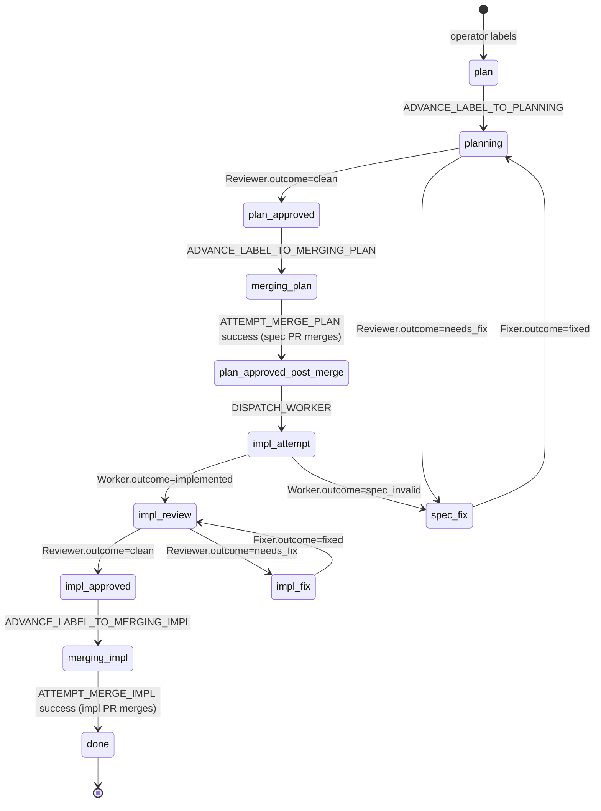

# Foreman v3 Reconciler — Architecture

**Status:** As-built reference as of 2026-06-07 (commit `dcb20ab`).
**Purpose:** Source of truth for how the v3 reconciler is supposed to work. PR reviews should bounce against this doc; if a change disagrees with it, either the code is wrong, the doc is stale, or the change is intentionally evolving the contract — in any of those cases, the disagreement should be named and resolved before merge.

This is a **reference**, not a tutorial. It assumes you know what foreman does at the product level (autonomous dev loop driven by GitHub labels). It documents the moving parts so you can answer: "where does this logic live?", "what's the contract between these modules?", "is this PR breaking something?"

When the code drifts from this doc, **update the doc in the same PR** that drifts it. Drift between code and doc is the bug class this document exists to prevent.

---

## 1. Top-level shape

```
              ┌────────────────────────┐
              │   GitHub (source of    │
              │       truth)           │
              └───────────┬────────────┘
                          │  GraphQL
                          ▼
┌─────────────────────────────────────────────────┐
│  v3 daemon process (`foreman daemon v3-start`)  │
│  ┌─────────────────────────────────────────┐    │
│  │  Reconciler.tick()  ── every 60s ────►  │    │
│  │  ├─ Observer fetch (GraphQL → snapshot) │    │
│  │  ├─ For each ticket: evaluate rules,    │    │
│  │  │     get Action                       │    │
│  │  └─ Execute Action (host calls +        │    │
│  │       exec_log writes)                  │    │
│  └─────────────────────────────────────────┘    │
│                          │                      │
│         ┌────────────────┴──────────────────┐   │
│         │                                   │   │
│         ▼ (label ops, merges, PRs)          ▼   │
│   Host (PyGithub +                  Subprocess  │
│   raw GraphQL)                      dispatch    │
│                                     (capped @1) │
└───────────────────────────────────│─────────────┘
                                    ▼
                            ┌───────────────┐
                            │ Role process: │
                            │  Planner /    │
                            │  Worker /     │
                            │  Reviewer /   │
                            │  Fixer        │
                            └───────────────┘
```

**Invariants:**
- **GitHub is the source of truth.** No daemon-side pipeline state. Every tick re-reads label + PR state fresh from GitHub.
- **Single-writer execution log.** Only the daemon writes to `~/.foreman/reconciler.db`. Role subprocesses send signals back to the daemon via subprocess exit codes (and side effects on GitHub), never by writing the log directly.
- **Idempotence via label state + log queries.** Rules consult the exec_log (`count_completed`, `has_unterminated`, `has_recent`) to avoid re-firing actions inside a budget window.
- **Concurrency cap = 1 (default).** One role subprocess at a time per daemon. Cap-skipped dispatches do NOT burn attempt budget.
- **Five GitHub App identities.** Planner, Worker, Reviewer, Fixer (the four "roles" — each one dispatches an LLM subprocess), plus the **orchestrator** (the daemon's own bot, used for direct host operations like label management, PR merging, observer polling). The orchestrator is not a role in the LLM-dispatch sense — it has no subprocess, no prompt, no schema — but it owns its own App identity and credentials. See §6.

---

## 2. Tick lifecycle

The reconciler runs one tick every `poll_interval_seconds` (default 60). One tick = one full reconciliation pass.

`Reconciler.tick()` — `packages/foreman/src/foreman/reconciler/daemon.py:167-228`.

**Step 1: Pre-tick — reload sentinel.** Check for `~/.foreman/reload-requested`. If present, consume + re-read config from disk + diff project registry. Newly-added projects are reconciled in the SAME tick. (daemon.py:175-177)

**Step 2: Per-project observer fetch.** For each project, ONE GraphQL query returns open issues with `foreman:*` labels + open PRs + recent merged PRs (`observer.py:49-118`). Result wrapped in `ProjectSnapshot`.

  Exception classification (`observer.py:130-140`):
  - `ObserverRateLimited` — "rate limit" in error message.
  - `ObserverUnreachable` — `ConnectionError`, `TimeoutError`, or network keywords in error message.
  - `ObserverError` — everything else.

  All three increment `_consecutive_failures[project]`. At exactly `alert_after_n_failures` (default 3), writes a single `observer_failure_alert` row (`daemon.py:196-209`).

**Step 3: Per-ticket reconciliation.** For each issue in the snapshot:
  1. Pick PR (`_pick_pr_for_ticket`) — when both spec + impl PRs are present, route by label phase (`daemon.py:34-92`).
  2. Build `ActionContext` (`actions.py:99`).
  3. Call `evaluate_with_rule(ctx)` — first-match-wins, safety tier first.
  4. If action ≠ `NOOP`, call `execute_action()` — writes a `running` start row, calls host, writes termination row on completion or exception.

**Step 4: Post-tick — shutdown sentinel.** Check for `~/.foreman/shutdown-requested`. If present, set the stop event so the next loop iteration exits cleanly. Polled AFTER all projects so the in-flight tick completes. (daemon.py:222-228)

**Step 5: Sleep.** `asyncio.wait_for(_stop_event.wait(), timeout=poll_interval_seconds)`. Returns either when the timeout fires (normal next tick) or when the stop event is set (graceful shutdown).

### Startup + shutdown

- **Lock acquisition.** OS-level exclusive lock on `config.reconciler.lock_path` (default `~/.foreman/reconciler.lock`). PID written as ASCII. Windows uses `msvcrt.locking`; POSIX uses `fcntl.flock` (`daemon_lock.py:88-108`).
- **Crash recovery.** Right after `log.init()`, the daemon calls `log.recover_orphaned()` which terminates every `outcome='running'` row with no termination as `outcome='errored:recovery'` (`exec_log.py:223-248`). Without this, `has_unterminated()` guards would treat a crashed-mid-action ticket as still running forever.
- **Shutdown channels.** Cross-platform sentinel file (works everywhere). On POSIX, SIGTERM handler additionally sets the stop event (`cli.py:744-751`). On Windows, sentinel-only — `os.kill(pid, SIGTERM)` maps to `TerminateProcess` (hard kill), so the sentinel is the only graceful path.

---

## 3. Label state machine

GitHub labels are the state. Every transition is driven by either (a) an action handler in `reconciler/actions.py` (label changes the daemon performs) or (b) a role subprocess writing back to the issue directly (`issue.set_labels()` after producing an outcome).

### Label inventory

Defined in `packages/foreman/src/foreman/init.py:78-123` as the `_FOREMAN_LABELS` tuple.

| Label | Phase | Meaning |
|---|---|---|
| `foreman:plan` | queue | Operator-set "queue for planning" entry label |
| `foreman:planning` | spec | Planner working, then Reviewer |
| `foreman:plan-approved` | spec→impl | Spec PR approved, queued for Worker |
| `foreman:merging-plan` | spec | Daemon attempting to merge the spec PR |
| `foreman:spec-fix` | spec | Reviewer wants spec changes; Fixer's queue |
| `foreman:impl-review` | impl | Worker finished, Reviewer's queue |
| `foreman:impl-approved` | impl | Impl PR approved, queued for merge |
| `foreman:merging-impl` | impl | Daemon attempting to merge the impl PR |
| `foreman:impl-fix` | impl | Reviewer wants impl changes; Fixer's queue |
| `foreman:hold` | safety | Operator pause; blocks all rules |
| `foreman:needs-help` | safety | Surfaced for human inspection |
| `foreman:done` | terminal | Pipeline complete; excluded from observer |
| `foreman:failed` | terminal | Attempts exhausted; human-readable marker |
| `foreman:impl-attempt-{1,2,3}` | annotation | Worker attempt counter |
| `foreman:fix-attempt-{1,2,3}` | annotation | Fixer attempt counter |

### Mermaid — happy path



(Safety paths — `hold`, `needs-help` — are layered on top; they preempt any forward-progress transition.)

### Observer filter (what GitHub returns)

The observer's GraphQL query filters issues by `filterBy: { labels: [...] }` — `observer.py:49-72`. The filter list includes every active-phase label PLUS the safety labels. It does NOT include `foreman:done` or the attempt counters.

**Consequence:** once a ticket reaches `done`, it leaves the snapshot and is never re-evaluated. This is the intended terminal state.

### Label producers + consumers

The full producer/consumer map (which code path adds each label, which rule predicate checks it) is in `reconciler/actions.py` and `reconciler/rules.py`. Key inconsistencies worth knowing:

- **`merging-plan` / `merging-impl` were ALSO removed by the action handler on successful merge as of foreman#190 (PR #191 just merged).** Previously these labels survived after merge — a ticket would carry `impl-approved + merging-plan` and no rule would match, silent stall. **If you see this drift again, file the bug.**
- **`done` is written but no rule consumes it.** Intentional — terminal state.
- **`failed` is written but no forward-progress rule consults it.** Human-readable marker; safety rules use log-count + entry label instead.
- **`hold` is consumed by `hold_label_blocks` but never written by reconciler code.** Operator-only.

---

## 4. Rule catalog

`packages/foreman/src/foreman/reconciler/rules.py`. Every rule has: `name`, `precedence` (int), `tier`, `when` (predicate), `then` (Action).

**Evaluation order:** safety tier first, then forward-progress tier, both sorted by ascending precedence. **First match wins.** A safety rule preempts everything below it.

### Safety tier (precedence 5–70)

These rules surface human attention or block forward progress. All safety rules return `SURFACE_HELP` or `NOOP`, and most are rate-limited via `has_recent("surface_help", ..., within_seconds=3600)`.

| Prec | Name | Trigger |
|---|---|---|
| 5 | `hold_label_blocks` | `foreman:hold` present → NOOP |
| 10 | `needs_help_label` | `foreman:needs-help` present → SURFACE_HELP |
| 20 | `mergeable_conflict` | PR.mergeable = CONFLICTING |
| 30 | `impl_pr_ci_failure` | PR.ci_status = FAILURE, head ref starts `foreman/impl-`, phase label in {impl-review, impl-approved, impl-fix} |
| 40 | `spec_pr_ci_failure` | Same but head ref `foreman/issue-` + planning label |
| 50 | `fix_attempts_exhausted` | `impl-fix` + `count_completed("dispatch_fixer_impl") ≥ 3` |
| 55 | `spec_fix_attempts_exhausted` | `spec-fix` + same shape on `dispatch_fixer_spec` |
| 60 | `impl_attempts_exhausted` | `plan-approved` + same shape on `dispatch_worker` |
| 65 | `reviewer_spec_attempts_exhausted` | `planning` + same shape on `dispatch_reviewer_spec` |
| 70 | `reviewer_impl_attempts_exhausted` | `impl-review` + same shape on `dispatch_reviewer_impl` |

### Forward-progress tier (precedence 100–170)

These rules drive the pipeline forward. All consult the exec_log for idempotence (`has_unterminated`, `count_completed`).

| Prec | Name | Trigger | Action |
|---|---|---|---|
| 100 | `dispatch_planner` | `planning`, no PR yet, no unterminated dispatch, `count_completed(..., outcome="success") == 0` | DISPATCH_PLANNER |
| 105 | `dispatch_reviewer_spec` | `planning`, PR exists + open + spec head ref, no unterminated, count < 3 | DISPATCH_REVIEWER_SPEC |
| 110 | `advance_label_to_planning` | `plan` only (no other foreman:* labels) | ADVANCE_LABEL_TO_PLANNING |
| 115 | `advance_label_to_merging_plan` | `plan-approved`, no `merging-*`, PR exists + open + spec head ref, `auto_merge_spec=true` | ADVANCE_LABEL_TO_MERGING_PLAN |
| 118 | `attempt_merge_plan` | `merging-plan`, PR exists + open + spec head ref | ATTEMPT_MERGE_PLAN |
| 120 | `advance_label_to_plan_approved_lagging` | PR merged + spec head ref + `planning` label + no recent advance within 24h | ADVANCE_LABEL_TO_PLAN_APPROVED |
| 130 | `dispatch_worker` | `plan-approved`, no unterminated, count < 3 | DISPATCH_WORKER |
| 140 | `dispatch_reviewer_impl` | `impl-review`, PR exists + open + impl head ref + CI=SUCCESS, no unterminated, count < 3 | DISPATCH_REVIEWER_IMPL |
| 145 | `dispatch_fixer_spec` | `spec-fix`, PR exists + open + spec head ref, no unterminated, count < 3 | DISPATCH_FIXER_SPEC |
| 150 | `dispatch_fixer_impl` | `impl-fix`, PR exists + impl head ref, no unterminated, count < 3 | DISPATCH_FIXER_IMPL |
| 158 | `advance_label_to_merging_impl` | `impl-approved`, no `merging-*`, PR exists + open + impl head ref, `auto_merge_impl=true` | ADVANCE_LABEL_TO_MERGING_IMPL |
| 162 | `attempt_merge_impl` | `merging-impl`, PR exists + open + impl head ref | ATTEMPT_MERGE_IMPL |
| 170 | `advance_label_to_done` | PR merged + impl head ref + `impl-approved` + no recent advance within 24h | ADVANCE_LABEL_TO_DONE |

**Test coverage:** every rule has at least one keystone test in `packages/foreman/tests/reconciler/test_rules.py`. If you add a rule, add a test that pins its trigger predicate AND a test that pins its idempotence guard.

**Why head-ref filters exist:** A ticket can have BOTH a spec PR (`foreman/issue-N`) and an impl PR (`foreman/impl-N`) in flight during the merge transition. Rules that target spec-side state must filter by `head_ref.startswith("foreman/issue-")` to avoid misfiring against the impl PR. Same for impl-side.

---

## 5. Action handlers

`packages/foreman/src/foreman/reconciler/actions.py`. The `Action` enum (lines 21-65) plus the `execute_action` dispatch function (line 281) plus the per-action handlers below it.

### Universal contract

Every action handler:
- Receives `ctx: ActionContext` with `snapshot`, `issue`, `pr`, `log`, `auto_merge_spec`, `auto_merge_impl`, `merge_mechanism`, `dry_run`.
- Writes a START row to exec_log (`outcome='running'`) via `write_action` before doing any host operation (line 315).
- Performs its host operations.
- On success: writes a TERMINATION row (`outcome='success'`) via `terminate_action(parent_log_id=start_log_id, ...)` (line 448).
- On exception: catches at line 450, writes a TERMINATION row (`outcome='error'`, details include the exception message).

**Dispatch actions are special** — they don't write the termination row synchronously. The subprocess runs in the background; a separate task (`_track_subprocess_completion` in `v3_host.py:860-930`) writes the termination row when the subprocess exits. See "Dispatch actions" below.

### Label-advance actions

`ADVANCE_LABEL_TO_PLANNING` (line 394), `ADVANCE_LABEL_TO_PLAN_APPROVED` (line 412), `ADVANCE_LABEL_TO_DONE` (line 425): all three follow the same shape — `remove_label(old)` then `add_label(new)`. Two separate host calls, not atomic.

`ADVANCE_LABEL_TO_MERGING_PLAN` (line 376) and `ADVANCE_LABEL_TO_MERGING_IMPL` (line 383): only `add_label`. The corresponding `attempt_merge_*` rule then takes over.

### ATTEMPT_MERGE_PLAN / ATTEMPT_MERGE_IMPL

Both delegate to `_handle_attempt_merge` (line 125). The handler reads `host.get_pr_mergeability()` and branches on `mergeStateStatus`:

| State | Action | Notes |
|---|---|---|
| `CLEAN` | `host.merge_pr(mechanism=ctx.merge_mechanism)` | Direct merge. As of #190, also removes `foreman:merging-*` label. |
| `BEHIND` | `host.update_branch()` | Server-side rebase; mergeability recomputes, rule re-fires next tick. |
| `BLOCKED` + pending checks > 0 | no-op | CI still running, wait. |
| `BLOCKED` + pending checks = 0 | `_surface_attempt_merge_needs_help` | Adds `foreman:needs-help`, posts comment. |
| `UNSTABLE`, `DIRTY`, unknown | `_surface_attempt_merge_needs_help` | Same. |
| `UNKNOWN` | no-op | GitHub still computing. |
| `DRAFT`, `HAS_HOOKS` | no-op | Documented no-ops. |

**Critical invariant (post-#190):** on successful `CLEAN` merge, the action MUST also call `host.remove_label(..., "foreman:merging-plan")` or `foreman:merging-impl`. Otherwise the stale label blocks the next rule from firing.

### Dispatch actions (`DISPATCH_*`)

All 6 dispatch actions are handled by the same code branch (line 345), keyed by `_DISPATCH_ROLE_FOR_ACTION` (line 106). They call `host.dispatch_role(role=..., target=..., owner, repo, issue, pr_number, start_log_id, project)`.

`host.dispatch_role` returns either an `int` (PID — dispatch succeeded, subprocess running) or `None` (cap-skip — concurrency cap full, try again next tick).

- **PID returned**: start row stays in `running` state. Background task writes termination when subprocess exits.
- **None returned**: action handler immediately writes a `skipped_capacity` termination row (line 368) and releases. `skipped_capacity` rows are EXCLUDED from `count_completed(outcome=None)` so they don't burn attempt budget (`exec_log.py:180-188`).

### Subprocess argv shape

`v3_host.py:773-811`. Role-specific:

- `planner`: `["foreman", "plan", <issue_url>, "--project", <project>]`
- `worker`: `["foreman", "implement", <issue_url>, "--project", <project>]`
- `reviewer`: `["foreman", "review", <pr_url>, "--project", <project>, "--target", "spec_pr|impl_pr"]`
- `fixer`: `["foreman", "fix", "--issue-url", <issue_url>, "--project", <project>, "--pr-url", <pr_url>, "--target", "spec_pr|impl_pr"]`

### Subprocess environment

Computed by `_build_role_subprocess_env` (`v3_host.py:291-327`). Inherits the daemon's env wholesale, then **overrides** sentinel + lock paths to noop tmp paths and **drops** `FOREMAN_STATE_DIR` + `FOREMAN_LOG_DIR`. This is defense-in-depth (foreman#345): without it, a role subprocess could resolve `foreman daemon stop`'s sentinel path to the prod path and accidentally shut down the daemon.

### Exec log API

`packages/foreman/src/foreman/reconciler/exec_log.py`.

- `write_action(...)` — insert a start row, returns new row id.
- `terminate_action(parent_log_id, outcome, details)` — insert a termination row pointing at the start row.
- `count_completed(action, ticket_id, outcome=None)` — count terminated rows. Default excludes `skipped_capacity` (line 184-188).
- `has_unterminated(action, ticket_id)` — True iff there's a `running` row with no termination.
- `has_recent(action, ticket_id, within_seconds)` — True iff any row exists within the time window. Used for `surface_help` rate-limiting (default 1h) and lagging-label idempotence (24h).
- `recover_orphaned()` — called once at daemon startup. Terminates every orphan `running` row as `errored:recovery`.

---

## 6. Roles

Four role subprocesses, dispatched by the daemon, each with its own CLI entry point and its own GitHub App identity. All four share the same structural pattern:

1. Parse CLI args + config.
2. Set up worktree (create or attach).
3. Load multi-layer system prompt (adapter preamble + vendored superpowers + role-specific contract).
4. Call provider (Anthropic SDK) with role-specific `allowed_tools`.
5. Validate LLM output against a Pydantic schema.
6. Perform deterministic host operations.
7. Write labels back atomically (Worker, Reviewer, Fixer — Planner doesn't write labels).

### Per-role contract

| Role | CLI | Module | Branch | App identity | Atomic label write? |
|---|---|---|---|---|---|
| Planner | `foreman plan <issue_url>` | `roles/planner.py` | creates `foreman/issue-N` | `planner_app_id` | No (no label writes) |
| Worker | `foreman implement <issue_url>` | `roles/worker.py` | creates `foreman/impl-N` from spec branch | `worker_app_id` | Yes (`set_labels` pre + post) |
| Reviewer | `foreman review <pr_url>` | `roles/reviewer.py` | attaches existing | `reviewer_app_id` | Yes (`set_labels` post) |
| Fixer | `foreman fix --issue-url <url> --target {spec_pr,impl_pr}` | `roles/fixer.py` | attaches existing | `fixer_app_id` | Mostly (additive pre-dispatch, atomic post) |

### The 5th identity: orchestrator

The four roles above are the **LLM-dispatching** identities — each one corresponds to a subprocess that loads a prompt, calls Anthropic, and validates structured output. There's a **fifth GitHub App identity** that does NOT dispatch an LLM: the **orchestrator**.

- **Config:** `OrchestratorConfig` at `config.py:50-82`. Owns `orchestrator_app_id` + private key.
- **Bot account:** `foreman-orchestrator-bot`.
- **Used by:** `daemon_host.py`, `identity.py`, `cli.py`, `reconciler/v3_host.py`.
- **What it does:** every direct host operation the daemon performs in its own name — `host.add_label(...)`, `host.remove_label(...)`, `host.merge_pr(...)`, `host.update_branch(...)`, observer GraphQL polling. Historically these would have used Jeff's PAT; the orchestrator bot gives every Foreman action a clean audit trail.
- **What it does NOT:** load prompts, call LLMs, write labels via `set_labels` (label writes via this identity are the targeted single-label `add_label` / `remove_label` calls from action handlers).

When you see a GitHub comment or label change authored by `foreman-orchestrator-bot[bot]`, it came from the daemon itself, not a role subprocess. The four role bots only act inside their own subprocesses.

The reason this matters for PR review: a change to action-handler code (anything in `reconciler/actions.py`) acts as the orchestrator. A change to a role subprocess (anything in `roles/*.py`) acts as that role's bot. Don't accidentally mix the two when audit-trail behavior changes.

### Output schemas

`packages/foreman/src/foreman/schemas/`. Each role's LLM output must validate against a Pydantic model:

- `PlannerOutput`: spec_doc_content, pr_title, pr_body, summary, considered_alternatives, confidence.
- `WorkerOutput`: outcome (`implemented` | `incomplete` | `spec_invalid`), work_comment, pr_title/body (iff implemented), spec_invalid_reason (iff spec_invalid), commits_made, sub-requests, did_check_pass, confidence.
- `ReviewerOutput`: outcome (`clean` | `needs_fix`), review_comment, findings (severity ∈ {critical, important}, no minor), confidence. **Validator enforces:** clean ⇔ findings empty, needs_fix ⇔ findings non-empty.
- `FixerOutput`: outcome (`fixed` | `incomplete`), fix_comment, commits_made, addressed_findings, unaddressed_findings (with `UnaddressedReason` enum), confidence.

### Worker's verification gate

Worker is the only role that runs `check_command` (default: `just check`). It runs TWICE:
- BEFORE the LLM — captures baseline failures.
- AFTER the LLM — captures post failures.
- `new_failures = post_failures - baseline_failures`.

If Worker claimed `implemented` but `new_failures` is non-empty, the orchestrator overrides the outcome to `incomplete` (`worker.py:850-860`). This is the gate that caught last night's `test_identity` false positive (foreman#183).

### Reviewer's `--target` plumbing inconsistency

Reviewer accepts `--target {spec_pr,impl_pr}` on the CLI but **does not plumb it into `run_reviewer()`**. Instead, Reviewer infers target from PR head_ref (`foreman/issue-N` → spec_pr; `foreman/impl-N` → impl_pr). Fixer DOES plumb `--target` through. Documented inconsistency; either an in-flight cleanup or a deliberate "head_ref is canonical" choice.

### Findings format (Reviewer → Fixer)

Reviewer posts findings as a fenced JSON block inside HTML comments in the PR review body. Fixer recovers them via regex on `pr.get_reviews()` (`fixer.py:185-227`). This is the **only** channel structured findings cross role boundaries; there's no in-memory forwarding.

If you change the marker format, you break the Fixer. Don't.

---

## 7. Known drift + open questions

These are real, in-the-code today. The list is curated; not every minor quirk is here.

1. **Reviewer `--target` CLI arg is accepted but not plumbed** through to `run_reviewer()`. Inconsistent with Fixer. Either a Stage-2 cleanup that didn't land or an intentional "head_ref is canonical" choice.

2. **Worker's pre-dispatch label transition is atomic** (`set_labels`) but **Fixer's pre-dispatch attempt label is additive** (`add_to_labels`). Worker has a `finally` block to revert on crash; Fixer doesn't. Possibly intentional (Fixer's attempt counter is "fire and forget") but the asymmetry isn't documented.

3. **Queue-merge mechanism (`merge_mechanism="queue"`) is wired but not exercised in tests.** `merge_pr` branches on it in `v3_host.py:447-450`, but no test_actions.py case sets `mechanism="queue"`. If we ever ship merge queues, the queue path needs its own integration test.

4. **No `foreman daemon ps` equivalent.** v2 had it; v3 doesn't. Diagnostic gap if a ticket parks mid-pipeline and you want to see why without grepping the SQLite log.

5. **`recover_orphaned()` runs at startup only — documented decision.** The recovery is called once in the daemon startup sequence (`cli.py:658-662`). In theory, if the daemon survives but `_track_subprocess_completion` somehow dies mid-flight (asyncio exception, GC), an orphan `running` row could persist until the next restart. We have NOT observed this in practice across weeks of operation — every orphan we've recovered was on the startup path, never mid-run. The fix surface is non-trivial (periodic recovery without a PID-alive check would falsely terminate legitimate long-running subprocesses; with one it requires a schema-compat change to store PIDs in the start row). **Decision: do not fix until we observe an actual incident.** If a stuck `running` row ever materializes in the exec_log with no live subprocess, file a fresh ticket then — we'll have real failure-mode data to design the fix against.

6. **Subprocess wall-clock timeout is 1 hour (`role_dispatch_timeout_seconds`) — deliberately conservative, awaiting empirical data.** The 1-hour ceiling was added by foreman#309 after a real Reviewer hang. Below the ceiling, the daemon waits indefinitely. With cap-1 concurrency, one hung subprocess can block the queue for up to 60 minutes. Typical legitimate runtimes today: Planner 3–5 min, Reviewer 2–5 min, Worker 10–15 min, Fixer 5–10 min — so 1 hour is ~4–20× headroom over typical. **Decision: do not lower the ceiling until we have empirical data from many runs across Foreman.** A prior version of this timeout was set too low and caused legitimate runs to get killed mid-flight; that incident is the reason 1 hour exists. Lowering the value (or moving to per-role timeouts) needs distributional data on real run durations, not a back-of-envelope estimate. If we observe another hang of the #309 class, file a fresh ticket then with the run-duration histogram attached.

---

## 8. How to use this doc in PR review

When reviewing a PR that touches the reconciler, check:

1. **Does this change a rule predicate?** Verify the test in `test_rules.py` is updated. Verify that the predicate's idempotence guard still holds across the changed shape.
2. **Does this change an action handler?** Verify the success path AND the failure path of the handler. Verify exec_log writes are present on both paths. Verify label cleanup is symmetric (any label added by this action must be removable by either this action or a downstream action — see #190).
3. **Does this change a role's host operations?** Verify the schema validator catches malformed LLM output. Verify the label-write atomicity matches the table in §6.
4. **Does this change the observer query?** Verify every label in `filterBy.labels` is still consumed by at least one rule predicate. Verify no rule predicate checks a label that the observer doesn't return.
5. **Does this change the env passed to subprocesses?** Verify the sentinel + lock path overrides still hold (foreman#345 class of bug).
6. **Does this change introduce a new label?** Update §3 of this doc in the same PR. Don't merge a code change that adds a label without updating this doc.

If a PR conflicts with this doc and the doc is correct, the PR should change. If the doc is wrong, the same PR should update the doc.

---

## Maintenance

This doc is a `dcb20ab`-vintage snapshot. The 5 source-of-truth code paths it documents:

- Label inventory: `init.py:78-123`
- Rule catalog: `reconciler/rules.py:148-218` + `:509-606`
- Action handlers: `reconciler/actions.py:281-456`
- Role subprocess argv: `reconciler/v3_host.py:773-811`
- Tick loop: `reconciler/daemon.py:167-228`

If you find this doc disagrees with any of those at a meaningful level, **either fix the doc in your PR or stop and ask**. Drift between code and doc is the bug class this document exists to prevent.
